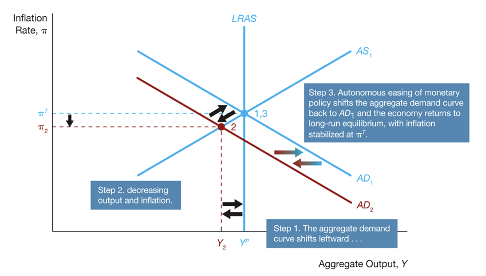
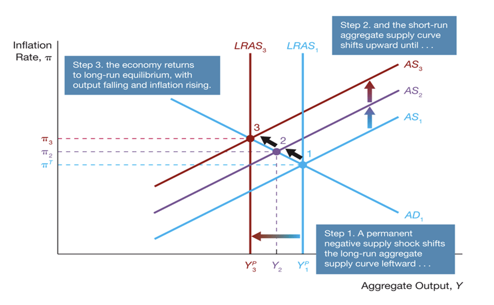
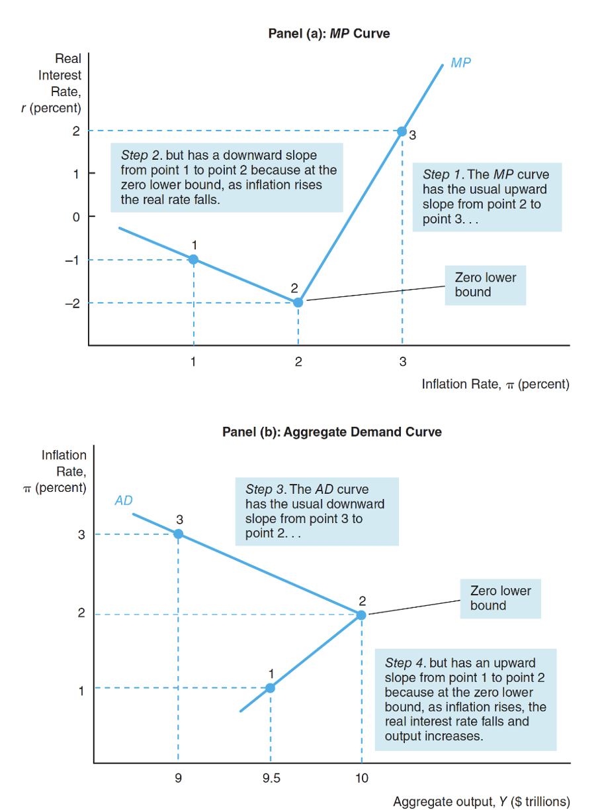
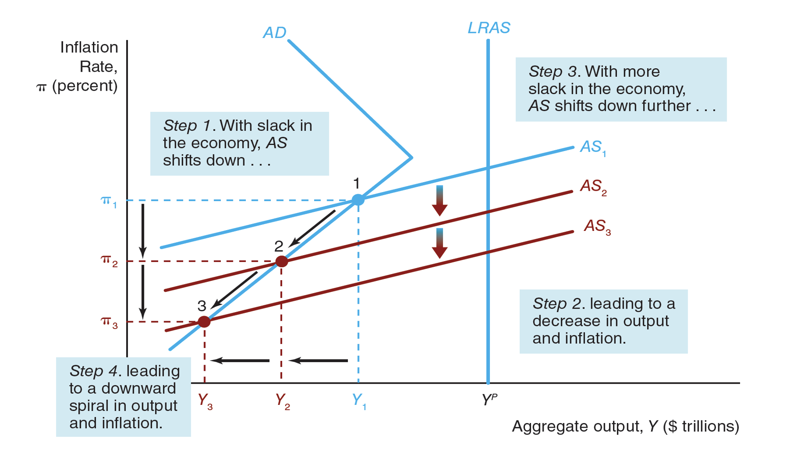

# Summary of Week9
- Definition of Aggregate Demand
- Aggregate Supply Curve
  - Short-run aggregate supply curve (SRAS)
  - Long-run aggregate supply curve (LRAS)
- Philips Curve
  - Look at inflation rate and employment rate instead of inflation rate and output
  - $\pi = \pi^e - w(u-u_n) + \rho$
    - $w$ is the weights of the unemployment gap
    - $\rho$ is the price shocks
    - $\pi^e$ inflation expectation
- Okun's Law
  - Relates output gap and unemployment gap
  - $U - U_n = \frac{1}{2}(y - y_p)$
  - $U- U_n$ is unemployment gap
  - $y - y_P$ is the output gap
- Philips Curves:
  - $\pi = \pi^e - w(u-u_n) + \rho$
  - $\pi = \pi^e - w(- \frac{1}{2}(Y - Y_P)) + \rho$
    - Why is this negative half?
  - $\pi = \pi^e - \gamma(Y - Y_P) + \rho$
    - where $\gamma$ is $0.5w$

# Week10 Content
- Use Aggregate Demand and Aggregate Supply Framework to do Policy Analysis

# AD Shocks

## Negative AD Shocks (No Policy Response)
Negative AD Sock => AD Curve Shift Down => New short-run eq => $Y_2$ < $Y_P$ and $\pi_2$ < $\pi^t$  
$y_2 < y_p$ => slack labor market => $\downarrow$ w => $\downarrow \pi$ => SRAS shifts right => New Long-Run Eq. at 3. $Y = Y_P$ and $\pi = \pi_2$. Notice that $\pi_3 < \pi_2 < \pi^T$

## Negative AD Shocks (Policy Response)
At 2, => Monetary policy => Monetary Easing => Shifts the AD Curve back up.

# Long-run Supply Shocks (No Policy Response)

## Negative Permanent Shock

At eq 1: decrease in predict output => increase in inflation rate => increase in expected inflation rate => decrease in SRAS  
At eq2: $y_3 > y_2^P$ => Positive output Gap => Tight Laour => increase in w  => Increase in p => increase in inflation rate => increase in expected inflation rate => SRAS shifts to the left (up) and become SRAS_3

**Shocks to long-run aggregate supply generates short-run flunctuations**  
**Real Busines Cycle Theory: Shocks to individuals' performance and technology shifts LAS curve. This in turn generates short-run fluctuations** => Neo-classical explanation of business cycles

# Long-run Supply Shocks (Policy Response)
- Monetary Policy shifts the AD curve
- Auto-correction shifts the SRAS curve

In 2: $Y_2 > Y^P_3$ => Monetary Tightening (Contractionary) via OMS

Then, the inflationr rate at 2 will be higher than the final inflation rate.

# Short-run Supply Shock
## No Monetary Policy Response
- Cost of production increases, such as the indegredients become too expensive or the worker unions push the salary rate too high (or possibly with legislation)

Recall that the SRAS equation is 
$$
  \pi = \pi^e - w(u-u_n) + \rho
$$

The shock is captured by $\rho$ in the SRAS equations. Now, if there is an increase in inported gods price => increase in $\rho$ => SRAS shifts to the right

Therefore, at 2, the labor market is lsack => decrease in wage => decrease in in price level => decrease in inflation rate => decrease in expected inflation rate => SRAS will shift down

Now, if you don't do anything it is will eventually shifts down because of the self-correction mechanism. Therefore, we will end up in the initial point.

At eq2
  - High Inflation Problem
  - Low GDP (High Unemployment)

### Policy Analysis

Therefore, you need to make a choice to stablise the prices (inflation rate) or you can choose to stablise the output. You cannot do both at the same time!
  - Stablise Prices (Decrease Inf)
    - Policy Intervention (Decrease Inflation)
      - Contractionary Policy => This will shifts the AD curve left. Hence the inflation rate will decrease
      - However,  it is not possible to stay in such position => Temporary Solution. Eventually, automatic stablisation mechanism will shift SRAS to the right. To keep inflation rate at thetargeted level, you have to make sure AD moves as well.
  - Stablise Output (Increase GDP)
    - Expansionary Policy => This wil shifts the AD curve right. Henc, then inflation rate will increase but the output gap is fixed
    - Monetary Policy Easing
  

# Short Run Fluctuations
- RBC (Neo-Classical)
  - Business cycles are due to change in $Y_P$ (permment supply shocks)
  - No ROLE for Monetary Policy!
- New Keynesian
  - Business cycles due to AD and short-run supply (price) shocks
  - MP has a role!

Now, people found new tools to fix the issue as it was not easily fixed with the forementioned tools. Particularly, some of the interest rate is falling close to zero.

# Monetary Policy at Zero Lower Bound (ZLB)
- MP -> $i$, short-term nominal interest interest rate using MP tools such as 
  - OMO
  - Discount Loans

Now, what if the $i \approx 0$ => ZLB

When, $i \approx 0$, the traditional MPs will NOT work <= policy rate (i) cannot be negative because of Arbitrary Conditions. However, note that real interest rate can be negative if interest rate is lower than the real interest rate (Notice $r = i - \pi$ by simplified fisher's equation).

MP: $r = \bar{r} + \lambda \pi$ Taylor's principle

Increase in $\bar{r}$ => MP tightening => increase in r => decrease I => decrease in aggregate demand

Decrease in $\bar{r}$ => MP easing => decrease in r => increase in I => increase in aggregate demand of output

Note that CBs decrease the real interest rate by lowering the policy rate ($i$)

- Suppose CB follos aylor Principle 

# Monetary Policy Curve with a Zero Bound

# Self-correting Mechanism at ZLB

Because of slack labor market, the SRAS shifts down as the inflation expectation decrease. However, this does not but simply shifts the curve further to the left and keep decreasing the actual output

As the self-correction is not working at ZLB => You need to do something as a CB. Hence, monetary policy is required. Yet, traditional policies will not work as the nominal interest rate is already at 0. Hence, new policies are developed
- Liquidity Provision
  - $r_c = r + \bar{f}$
    - when it is at bad time, financial friction will kick in and the real cost of borrowing will increase
    - Note that we cannot play with $r$ as we cannot change $i$ anymore.
    - However, we can change the $\bar{f}$, i.e. makes the process of lending and borrowing easier.
    - Then, decrease in $\bar{f}$ will lead to decrease in $r_c$.
  - Qunatitative Easing
