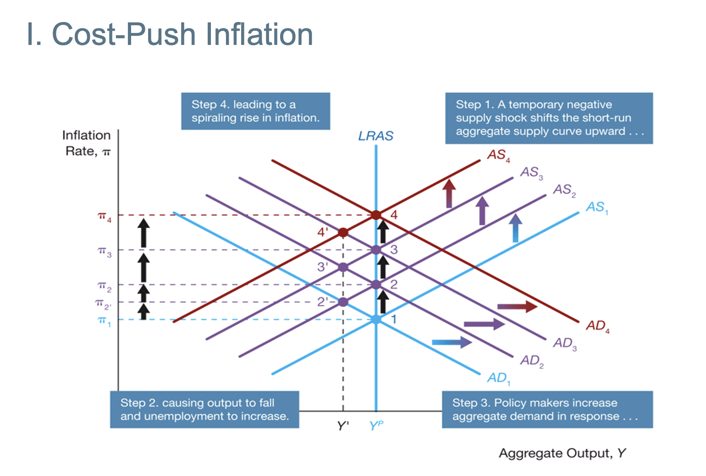
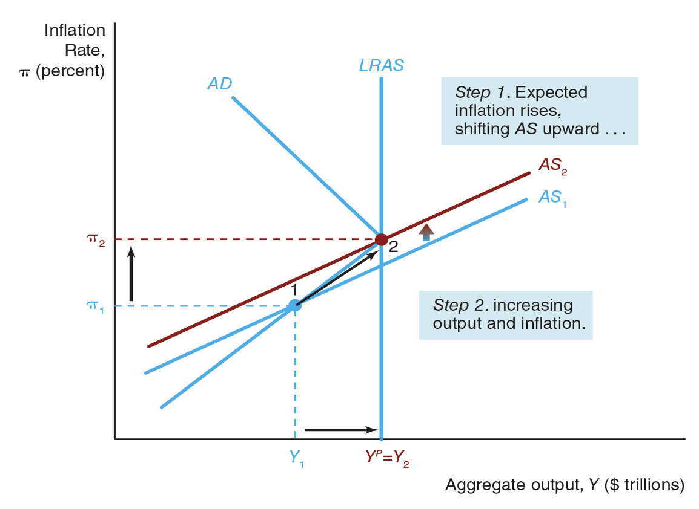

# Inflation

## Cost-Push Inflation

## Demand-Pull Inflation

# Monetary Policy at ZLB

## Liquidity Provision
- A central bank can bring down financial frictions directly by increasing its lending facilities in order to provide more liquidity to impaired markets so that they can return to their normal functions.
- This decline in financial frictions lowers the real interest rate for investments.

Recall that $r_c = r + \bar{f}$

Then, we can affect the the financial friction $f$ to make the real cost of borrowing lower. Note that, although we cannot change the real interest rate because we cannot change the short-term nominal interest rate anymore. However, we can change the financial friction to affect the real cost of borrowing.

## Quantitative Easing
Note that many times, when firm making decision, those are long-term decisions. Therefore, the most important one is long-term real interest rate.

$$
    r_{\text{long-term}} = r_{\text{short-term}} + \text{premium}
$$

Note that we can no longer affect the short-term real interest rate. However, we can change the premium. Now, quantitative easing, we will <ins>buy private assets as a CB</ins>. Therefore, this will cause the decrease in premium and hence the decrease in real long term interest rate. Therefore, this would increase the aggregate demand. 

* note that buying quantitative easing is similar to open market purchase. This allows to decrease the premium 

## Forward Guidance (Mangement of Expectations)
- This is by affecting the individual expectations of inflation rate.
- Forward Guidance shifts SRAS

# The Role of Expectations in Monetary
- Recall the expectation of the inflation rate can change the SRAS

## Lucas Critique of Policy Evaluation
- Macro-economtric models - collections of equations that decribe statistical relationships among economic variables -
  - Are used by economists to forecast economic activity and to evaluate the potential effects of policy options
- In his famous paper "Econometric Policy Evaluation: A Critique," Robert Lucas argued that
  - econometric models are unreliable for evaluation policy options if they do not incorporate rational expectations
- According to Lucas, when policies change,
  - public expectations will shift as well,
  - and such changing expectations can have a real effect on economic behavior and outcomes. 

## Policy Conduct: Rules or Discretion?
- Policy Rules
  - are binding plans that specify how policy will respond (or not respond) to particular data such as unemployment and inflation
- Policy discretion
  - is applied when policy makers make no commitment to future actions, but instead make what they believe in that moment to be the right decision for the situation

### Rule-Based
- Rigid (Not good)
- Prevents time-inconsistency problem (Good)
- Time-inconsistency: When long-term plans are ignored when time comes

### Discretionary MP
- Flexible $\implies$ Easier to fix a problem, particularly sudden ones
- Time-inconsistency problem

### Constrained M.P
- Flexible
- No Time-Inconsistency Problem (Most of the time, minimises)
- Many CBs follow this!
- Setting up a NOMINAL ANCHOR!
  - target custom inflation level (Inflation Targeting)
  - Having nominal anchor $\implies$ Increase in credibility
  - Australia: 2 - 3%

## Type of Rules
- Non-activist rules: do not react to economic activity
  - Milton Friedman's constant-money-growth-rate rule
- Activists: monetary policy reacts to changes in economic activity

## Credibility and AD Shocks

$$
  \pi = \pi^e + \gamma(Y - Y^P) + \mathcal{p}
$$

If a CB is credible, then we can believe their targets. 

### Credible CB
- Since the CB is credible, we will believe that their monetary policy will work and does not change the expectation.
- Therefore, it will eventually go back to the original inflation rate.

### Non-credible CB
- Since CB is not credible, when we see the output level is higher than the potential output level, we will adjust expectation of inflation rate.
- The public does not blieve CB is credible enought to keep inflation rate and the target inflation rate)

## Negative short-run Supply Shock
- $\rho$ is the inital price (supply) shock
- Negative supply shock: $\rho$ is increased from $\rho_0$ to $\rho_1$

### Credible CB vs Non-credible CB
- The increase in the inflation rate won't change a lot because the inflation expectation is not adjusted.
- Non-credible is vice-versa

## Anti-inflation polcy
- If the CB is credible, we believe the CB and drop my own inflation expectation to the CB's level.
- On the other hand, if we don't believe in the CB, we choose to not adjust our inflation expectation as much.

## How to have a credible CB?
- Inflation Targeting
  - Strategy that involves:
    - public announcement of medium-term numerical targets for inflation
    - an institutional commitment to price stability as the primary, long-run goal of monetary policy 
    - an information-inclusive approach in which policymakers use many variables in making decisions about monetary policy
    - increased transparency of the monetary policy strategy through communication with the public and the markets
    - increased accountability of the central bank for attaining its inflation objectives
  - Adopted by many countries, beginning with New Zealand, Australia, Canada and the United Kingdom

- Appoint “conservative” central bankers 
  - The public will then expected that the “conservative” central banker will be less tempted to pursue expansionary monetary policy and will try to keep inflation under control

# Transmission Mechanism
We are changing the short-term nominal interest rate to change many other things, consumption demand, export...

Therefore, we will now look at how the change in the interest rate can affect these things. There are many channels.

* Note that: Australia has variable mortgage rate! This allows the change in interest rate will change the mortgage rate and have a chanel to change the consumer behaviours.

Three mechanism:
- Traditional Interest Rate Channel
- Other Assets
- Credit View

## Traditinoal Interest Rate Channle
- Works through the investment demand
- For example, they may affect the policy rate (short-term interest rate). Note that they cannot even decide it, but just affect it.
- Fisher's Equation:
  - $r_{\text{short-term}} = i_{\text{short-term}} - \pi$
- Since prices are sticky, changes in short term policy rate can affect the real interest rate.

## Other Assets
- Foreight Exchange Rate
  - Decrease in short-term interest rate $\implies$ Decrease in long term real interest rate. Therefore, demand for domestic assets decreaes, and hence lower the demand for domestic currency. Therefore, this will decrease the exchange rate. Therefore, lowering the import and increasing the export. Therefore, net export will increases and hence increase in aggregate demand.
- Price of Equities
  - Decrease in the short-term nominal interest rate. THerefore, decrease in short-term and long-term real rate. If this interest rate is lower, then investors will go to the stock market (equity market) since bond market is nto good. This would increase the stock prices ($P_s$). Hence the market value of the firm will increase. Now, Tohn's Q Theory $Q =\frac{\text{Market Value of FIrm}}{\text{Cost of Capital}}$. Therefore, Q will increase. Therefore, new captial will be relatively cheap (new capital can be generated quite easily). This will lead the firm to issue more stocks and hence increase in investment.
- Wealth Effect (Consumer's Slide)
  - Cosumption decisions depends on life-time resources: Resources smoothing.
- Increase in stock price $\implies$ Increase in value of infnacial wealth $\implies$ Increase of life-time reousrces $\implies$ Increase in comsumption demand $\implies$ Shift the demand curve.

## Credit View
- It is more important as we can access to the foreign market quite easily, this is more important.
- Banks Lending Channel
- Balance Sheet Channel
- Note that this is far from complete and still a very hot research area

### Bank Lending Channel
- Expansionary MP $\implies$ Decrease in interest rate $\implies$ Bank reserves (because of expansionary moentary policy). Therefore, bank will increase on bank loans. Therefore, increase in investment and hence increase in aggregate demand.

### Balance Sheet Channel
1. Firm's Balance Sheet: decrease in real interest rate, and increase in stock price. Firm's Net Worth will increase (similar to the Q theory). Therefore, decrease. Therefore, less adverse selection and decrease in moral hazard. Hence, increase in lending, and increase in inestment, resulting in aggregate demand
2. Cash Flow: decrease in real interst rate $\implies$ Increase in stock price $\implies$ Increase in Firm's cash flow $\implies$ Increase in liquidity of firms $\implies$ Increase in Pay bills $\implies$ Decease in adverse Selections and decrease Moral Hazard. Therefore, increase in lending and investment, resulting in increase in aggregate demand.
3. Hosehold Liqudity: Decrease in real interest rate $\implies$ Increase in value of financial assets. Therefore decrease in financial Problems. Therefore increase in consumer .. and housing $\implies$ Increase in aggregate demand.

-----------------
* Adverse Selection: You never know if you select the bad borrower that does not return the money.
* Moral Hazard: Good people can become bad and decide not to pay back.