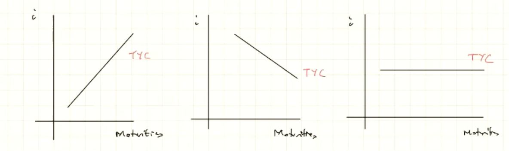

# Learning Objectives
- Understand the basic operations of the stock market
- Explain how stock prices are determined
- Explain the connection between the assumption of rational expectations and the efficient markets hypothesis
- Discuss the actual efficiency of financial markets
- Discuss the basic concepts of behavioural finance

# Last Week Summary
- Interest Rate
  - Risk Structure (Bonds)
    - Same Maturity
    - Differ in Risk
    - Defaul Risk Premium $\rightarrow$ Compensation for the risk
      - $\text{Default risk premium} = i_{Bond} - i_{Safe \; Asset}$
      - $\uparrow$ Default risk premium $\implies$ $\downarrow$ Demand $\implies \downarrow$ Price $\implies \uparrow i$ 
  - Term Structure (Bonds)
    - Same Risk Structure
    - Differ in Maturities
    - The important tool is the yield curve. $\rightarrow$ Idicator of the way we are going
      - Shows the relationship between interest rate and maturities
  

## Yield curves
- The first one is the only good one, how the nature should be.
- The second one is the indicator for things that are goin wrong.
- The third one is also an indicator for things going bad.

## Estimation of the future short term rate $i^e_{n}$

### 3 Facts
1. $i^{long-term} > i^{short-term}$
2. Sometimes $i^{short} \geq i^{long}$
3. Co-movement between the short-term rate and the long-term rate

### 3 Theories
- Expectation Theory
  - $\displaystyle i_{2t} = \frac{i_t + i^e_{t+1}}{2}$
  - Good to explain co-movement
  - Fails to explain the first and second fact above.
- Segmented Market Theorem
  - Good to explain why the long-term rate is generally higher than the short-term rate
- Liquidity Premium Theory
  - The nice one that explains everything
  - $\displaystyle i_{2t} = \frac{i_t + i^e_{t+1}}{2} + l_t$
  - The last term improves the expectation theory by giving the ability to explain why the long-term is typically higher than the short-term

## Bond Market Model
If you have an upward slopping yield curve, 

- Note that this is particularly important to consider that the supply of the long-term bond is more wanted by the company.

# Stocks and the Stock Market
- **A stockholder (or shareholder)** has a legal claim on the firm's profits and on its equity (assets minus liabilities).
- **Stocks** are called equities because ownership of stocks represents partial ownership of a firm
- **A sole proprietor** (sole owner) is someone who owns a firm and has unlimited liability for the firm's debts.
- **An investor** who owns stock in a firm organised as a corporation is protected by limited liability
- **Corporations** are run by the boards of directors who appoint officers, such as CEO, CFO, COO.
- **Dividend** is a payment that a corporation makes to stockholders (similar to coupon in bond).
- **Two types of stockholders:**
  - Preferred stockholders $\implies$ receive a fixed dividend that is set when the corporation issues the stock
  - Common stockholders receive a dividend that fluctuates as the profitability of the corporation varies over time.
  - Mostly common
- A firm's market capitalisation is the total market value of a firm's common and preferred stock. 

# Stocks and the Stock Market
- A publicly traded company is a corporation that sells stock in the stock market => Only a small portion 
- ...Some other things about the stock

## Measuring the Performance of the Stock Market
- **A stock market index** is an average of stock prices that is used to measure the overall performance of the stock market.
- **Fluctuations in the Stock Market**
  - More risk, risky than bonds

## Does the Performance of the Stock Market Matter to the Economy?
- Fluctuations in stock prices can affect the economy by affecting the spending of households and firms
- Corporations: Important source of funds
- Households: IMportant part of wealth!
  - $\uparrow P_{stock} \implies \uparrow wealth \implies \uparrow Spending$
  - Then, this loops back to the funds to the company $\implies$ positive loop back
  - $\uparrow Fluctuations\implies$ $\uparrow \text{Uncertainty (Unlike by Economists, affecting the economics decision)} \implies \text{Negatively Affect Economic Decision}$
  - Why negative?
    - Cosumers: Delay spending
    - Firms: Delay investment

## How to Determine the Stock Price?
- **The price of a financial asset** is equal to the present value of the payments to be received from owning it.
- **The required return on equities** $(k_e)$ is the expected return necessary to compensate for the risk of investing in stocks
  - Remember that stock is riskier than bonds. Hence it is the expected returns in the bonds market
- The equity premium is the additional return investors must receive in order to invest in equities rather Treasury bills.
- The equity preium consists of two components:
  - Systematic risk -- price fluctuations in the stock market that affect all stocks
  - Unsystematic (idosyncratic) risk -- movements in the price of that particular stock.

### Fomulation
$$k_e = \text{"the expected return" necessary to compensate for Risk}$$
Note the basic assumption here is that if we don't get $k_e$ will not hold a stock.
$$P_S = \text{Expected PV of payments received \hspace{10pt} (More uncertainty and factors that contributes to this)}$$
$$P^S_0 \text{(Price of stock today)} = \frac{D_1}{1 + k_e} + \frac{P^S_1}{1 + k_e}$$
Note that both the dividends and present price in the future are two unknown. The first term is the PV of the dividends, then second term is the PV of the next year's stock price
$$Equity \, Premium = k_e - i_b$$
,where $i_b$ is the risk free rates on the treasury bonds (safe assets). Note that the Equity Premium will change over times.
  - Systematic Risk : Associated to the market
  - Unsystematic (idosyncratic) risk : Associated to corporation

#### Rate

$$\text{Rate of Return on Bonds} = \frac{\text{Coupon}}{\text{Initial Price}} + \frac{\text{Capital Gain/Loss}}{\text{Initial Price}}$$
,where the first term is the coupon yield (known), and the second part is unknown.

Then, similary, we can get:
$$\text{Rate of Return on Stocks} = \frac{\text{"Expected" Dividends}}{\text{Initial Price}} + \frac{\text{Capital Gain/Loss}}{\text{Initial Price}}$$
 ,now we have two unknowns (both terms are unknown). Therefore, we have larger uncertainty in the stock market.

 $$Rt = \frac{D^e_{t+1}}{P_t} + \frac{P^e_{t+1} - P_t}{P_t}$$
 ,where $R_t$ is the rate of return. <u>This is the same as the word formulat above.</u> Note that there are difference between the tax on dividends, and tax on capital gains.  
 Note that the <u>Tax on Dividends is subject</u> to double taxation. The following is an illustration of a possible situation.

 

 Now, as a certified economist, we care more about the effect of such an economic action.

- Problems Associated of Double Taxations
  - Shareholder
    - $\downarrow \text{After-tax return} \implies \downarrow \text{Demands} \implies \uparrow \text{Inefficiency}$
  - Firms
    - Retain profit $\implies$ Re-invest $\implies$ might generate inefficiency. 
    - if **rate of return from re-investment** < **rate of return from other users**.

- Taxes on Capital Gain $\rightarrow$ "Lock-in" effect $\implies$ Inefficiency.

Then, why we want to have tax if it creates inefficiency? We are reducing inequalities. This is a typical <u>**equalty-efficiency trade-off**</u>

### Stock Price Formula

$$P_0^S = \frac{D_1}{(1 + k_e)^1} + \cdots + \frac{D_n}{(1 + k_e)^n} + \frac{P_n}{(1 + k_e)^n}$$
Note that as $n \rightarrow \infty$, you can ignore the last term since it goes to zero. 

Therefore, if $n$ is large enough, $P_0$ is not affected by $P_n$.
$$P^S_0 = \sum_{t=1}^\infty \frac{D_t}{(1+k_e)^t}$$

However, the above formula is very hard to calculate since it very hard to know all the values of the dividends. We call this $(P^S_0)$ the ***"fundamental value of stock"***.

### Simpler Values
However, we do have a simpler models that calculate $P_0^S$, which is Gordern-Growth Model:
$$P_0^S = \frac{(1+g)D_0}{(k_e - g)}$$
,where $D_0$ is the current dividend. We also have to assume the growth rate, $g$ of the dividend. This is assuming the expected profit is increasing.
$$\uparrow \pi^e \text{(expected profit)} \implies \uparrow \text{expected divs.} \implies \uparrow g \implies \uparrow P_0 \text{(2 ways)}$$
Therefore, by involving a little economics here, which is the implication on recession,
$$\text{Recession} \implies \downarrow \pi^e \implies \downarrow \mathbb{E}\{\text{Dividends}\} \implies \downarrow g$$
Also,
$$\uparrow Unvertainty \implies \uparrow \text{High discount of futures} \implies \uparrow k_e$$
Therefore, both factors above will lead to decrease in the current price of stocks.

### Now, We are in a Recession... What will happen?
Monetary Policy: $\downarrow i$ to overcome recession
- 1st Channel (Bond):
  - $\downarrow i \implies \downarrow \text{Return on bonds} \implies \downarrow k_e = i_b + \text{eq. premium} \implies \uparrow P^S_0$
- 2nd Channel (Stock):
  - $\downarrow i \implies \uparrow \text{Econ Activities} \implies \uparrow \pi^{future} \implies \uparrow \text{Div} \implies \uparrow g \implies \uparrow P^S_0$

Therefore, we can clearly both channels will cause the increase in stock priceses because of the positive effects on both the growth rate and the expected rate.

#### Assumptions of the Gordon-Growth Rate Model
Note that these assumptions are typically quite strong, particularly the assumption of the growth rate is a constant.

## How Stock Prices are Determined?
- The price is set by the buyer willing to pay the highest price
  - The market price will be set by the buyer who can take best advantage of the asset
- Superior information about an asset can increase its value by redicing its perceived risk.
  - Information is important for individuals to value each asset
  - When new information is released about a firm, expectations and prices change
  - Market participants constantly receive information and revise their expectations, so stock prices change frequently.

# Rational Expectations (RE) and Efficient Market Hypothesis (EMH)
- **Expectations:** are important in the economy because many transactions require participants to forecast the future
- **Adaptive expectations:** People make forecasts of future values of a variable using only past values of the variable
  - Changes in expectations will occur slowly over time as data changes
  - However, people use more than just past data to form their expectatios and sometimes change their expectations quickly.

## The Theory of RE
- Expectations will be identical to optimal forecasts using all variables available.

The following is the adaptive expectation:
$$\pi^e_t = (1-\lambda)\pi_{t-1} + (1-\lambda)\lambda\pi_{t-2}$$

However, this is not useful since it only focus on the past and not useful to forecast into the future. 

The expected value of an economic variable $X$ should be the optimally forecasted value of the varaible.
$$X^e = X^{Of} (\neq X^{Actual} \text{ is OK!!})$$

Note that $X^C - X^{Actual} =: \text{Forecast Error}$ should not be able to be predicted and have zero mean. Note that these two features are called <u>***Rational Expectation***</u>.

### Rational Expectation Decision Process Example
- Interest rate $(i)$ $\rightarrow$ $i^{normal}$
- $i^{today} > i^{normal}$
- Optimal Forecast $\implies \downarrow i^{future} \;\; (i^{future} \rightarrow i^{normal})$ approaches.
- News arrive: if $i$ is high, $i$ will stay high.
- Then, revise your optimal forecast: $\uparrow i^{future}$.

Note that how the expectation is changed when a new news arrived. You use all available information!

## IMplications fo the Theory of the RE
***The Efficient Market Hypothesis!!!***

## The Efficient Market Hypothesis
- At the beginning of the period, we know $P_t$ and $D$
- $P_{t+1}$ is unknown and we must form an expectation of it.
- The expected return then is
$$R^e = \frac{P^e_{t+1} - P_t + D}{P_t}$$
- Expectations of future prices are equal to optimal forecasts using all currently available information so
$$P^e_{t+1} = P^{of}_{t+1} \implies R^e = R^{of}$$
- Supply and Demand analysis states $R^e$ will the equilibrium return $R^*$, $R^{of} = R^*$.
- Current prices in a financial market will be set so that the optimal forecast of a security's return using all available information equals the security's equilibrium return.
- In an efficient market, a security's price fully reflects all available information.
  
### Rational Behind the EMH
 $$R^{of} > R^* \implies P_t \uparrow \implies R^{of} \downarrow$$
 $$R^{of} < R^* \implies P_t \downarrow \implies R^{of} \uparrow$$
 $$untill$$
 $$R^{of} = R^*$$
Note that the first step of the two things above happen with the market force stepping in and interfere the price. 

In an efficient market, all unexploited profit opportunities will be eliminated.

### The EMH: Arbitrage
- Financial abitrage is the process of bying and selling securities to profit from price changes over a brief preiod of time.
- The profits made from financial arbitrage are called arbitrage profits
- As long as there are some traders with rational expectations, the arbitrage...
- All you need to know: Application of the rational expectaion and it says that it simply says that the stock market price should be able to represent the fundamental price of a stock.

### The EMH: Are Stock Prices Predictable?
- A key implication of the efficient markets hypothesis is that stock prices are not predictable. The price today reflects all available information
- Rather than being predictable, stock prices follow a random walk

### Efficient Markets and Investment Strategies
- Portfolio Allocation
  - The efficient markets hypothesis implies that we should hold a diversified portfolio of stocks and other assets, instead of only one stock.
  - News that may unfavorable affect the price of one stock can be offset by news tha will favorably affect the price of another stock.
- Trading
  - It is better to buy and hold a diversified portfolio over a long period of time than to churn a portfolio by moving funds repeatedly between stocks.
  
## Anomalies with Efficient Market Hypothesis
- Some analysts believe they have identified stock trading strategies that can result in above average.
- Mean reversion - the tendency for stocks that have recently been earning high returns to experience low returns in the future, and vice versa. => Typically stick to the mean.
- Momentum investing - persistence occurs in stock movements so that a stock that is increasing in price is more likely to continue to rise, and vice versa (the opposite of mean reversion)

## Behavioral Finance
- Behavioral finance is the application of concepts from behavioral economics to understand how people make choices in financial markets.
- Behavioral economics is the study of situations in which people make choices that do not appear to be economically rational.
- People may not realize that their actions are inconsistent with their goals, e.g., being unrealistic about their future behavior.
- Some investors believe they see useful patterns in plots of past stock prices even if the prices are actually following a random walk.
- Investors also show a reluctance to admit mistakes by selling their losing investments.
- All you need to know:
  - Although the EMH provides some explaination for the market, it is not perfect and behavioral economics & finance provide explaination to these observations that were not explained by EMH.