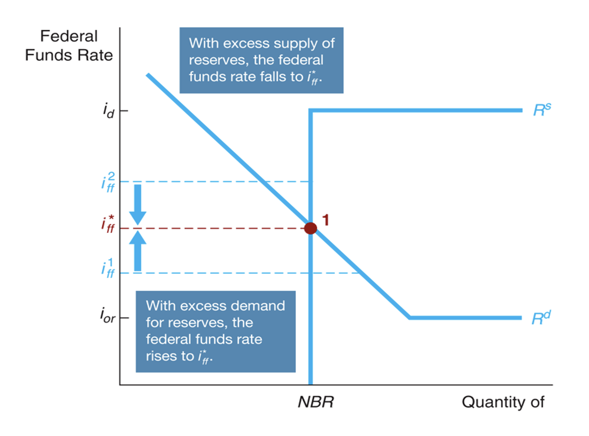
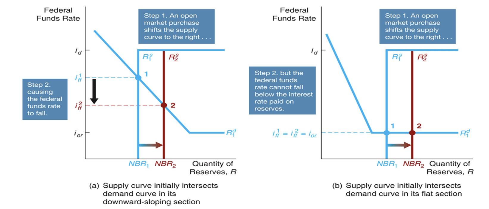
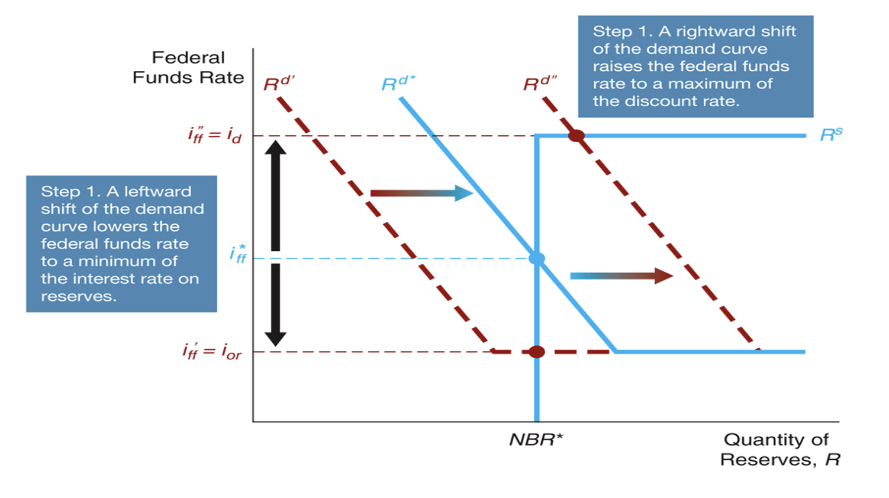

# Monetary Policy
## Learning OBjectives
- Describe the goals of monetary policy.
- Understand how Central Banks use monetary policy tools to influence the policy rate.
- Trace how the importance of different monetary policy tools has changed over time.
- Explain the role of monetary targeting in monetary policy.

## Six monetary policy goals:
-    Price stability
-    High employment
-    Economic growth
-    Stability of financial markets and institutions
-    Interest rate stability
-    Foreign-exchange market stability

# The Goal of Monetary Policy

## High Employment
- High Employment, or low unemployment rate, is another key monetary policy goal
- Unemployment provides the only source of sustained real increases in household incomes
- Economic growth depends on high employment
- Stable economic growith allows firms and housholds to plan accurately and encourages long-term investment

## Stability of Financial Markets and Institutions
- When financial markets and institutions are not efficient in matching savers and borrowers, the economy losses resources
- The stability of financial markets and institutions allow for efficient matching of savers and borrowers

## Interest Rate Staility
- Like fluctuations in price levels, fluctuations in interest rates make planning and investment decisions difficult for households and firms
- Central Banks' goal of interest rate stability is motivated by political pressure and a desire for a stable financial environment
- Sharp interest rate fluctuations cause problems for financial Institution. So, stabilising interest rates can help to stabilise financial system.

## Foreigh-Exchange Market Stability
- Exchange rate rate will affect the exports and imports will be affected
- Fluctuating currency causes negative effet of export and imports

## The Fed's Dual Mandate
- Two goals: Price stability and Economic growth (which is  maximum employment).

# Monetary Policy Tools
- A Central Nak's three traditional policy tools are:
  - Open market operations
    - The central bank starts buying products in the open market
  - Discount policy
    - Discount policy is the policy tool of setting the iscount rate and the terms of discount lending
    - Doscount window is the means by which the CB makes discount loans to banks.
    - This serves as the channel for meeting the liquidity needs of banks
  - Reserve requirements
    - Reserve requirement is the regulation requiring banks to hold a fraction of checkable deposits as vault cash with the CB
  
## Interest on Reserve Balances
- Banks had long complained that the Fed's failure to pay interest on the banks' reserve deposits amounted to tax.
- Paying interest on reserve balances gives the Fed another monetary policy tool.
- The policy started in 2008
- By increasing the interest rate, the Fed can increase the level of reserves banks are willing to hold, thus restaining bank lending and the money sypply
- Lowering the interest rate would have the opposite effect

## The Federal Funds Market
The CB and banks will be lending to and from each other.
- All interest rates will follow the policy rate
- A policy rate is a short-term interest rate that can be DIRECTLY affected by CBs through Monetary Policy tools
  - Note that CB cannot determine the cash rate, the market will do. However, it can affect it affecting the demand and supply.
- Focus on US policy rate
  - Demand and Supply in the Market of Reserves
  - What happens to the quantity of reserves demanded by banks, holding everything else constant, as the federal fund rates (policy rate) changes

### Explaination:

- Why Banks demand reserves
    - to meet their legal obligations (Required Reserves)
    - to meet their liquidity needs (Excess Reserves)

- CBS
  - Non-borrowed reserves
  - Borrowed reserves

#### What rates do bank receive?
1. Borrwo from each other paying $i_{ff}$
2. Borrow from CB paying the discount rate $(i_d)$
3. Keep reserves and earn $(i_{re})$

Therefore, the graph becomes:
- $i_d$ is the upper bound since every bank has the option to borrow from CB with the discount rate
- $i_{re}$ is the lower bound since every bank can always just put it in the reserve
- 

- The vertical line => No borrwoing from CB if $i_{ff} < i_d$ => Bansk borrow from each other
- The horizontal line => No borrowing from each other if $i_{ff} > i_d$ => Banks simply borrow from CB

#### Therefore, to determine the policy rate...

Therefore, for the CB to "control" the ff rate, they will typically affect the supply curve ($R^s$)

#### Open Market Purchase!
*Note that Q is the Quantity of reserves, R*
Therefore, the number of reserve NBR will shift to the right. However, the actual effects depend on where the intersection between supply and demand curves intersect.

Note that only the first one may change the federal funds rate, but the second will have no effects on the federal funds rate.

##### Dynamic vs. Defensive Open Market Operations (OMOs)
- **Dynamic open market operations** are intended to change monetary policy i.e. changing the policy rate.
- **Defensive open market operations** are intended to offset temporary fluctuations in the demand or supply for reserves, not to carry out changes in monetary policy.

### Well, what if we change the discount rate instead?
Well, yet we need to consider another different possible interesections.

* note that it is an effective policy only if the original federal funds interest rate is the same as the discount rate. Then, by reducing it, we shall still get the same discount rate.

### We can also change the required reserve...

- When the Fed raises reserve requirement, the federal funds rate rises and when the Fed decreases reserve requirement, the federal funds rate falls. 

### Now, we since we are changing the reserve, we can also change the reserve rate! Many things to change!

## Summary
Note that these graphs can tell you the tendency, but does not provide numerical measure of the change! It requires much more complicated mathematic models to achieve better numeric estimation.

### Limiting Flucuation
Note that these proccedures can actually limit the fluctuation of the policy rate by controlling it in a fixed interval.

## OMO vs Other Policy Tools
- The benefits of open market operations include control, flexibility, and ease of implementation.
- Discount loans depend in part on the willingness of banks to request the loans and so are not as completely under the CBs control.
- The CB can make both large and small open market operations. Often, dynamic operations require large purchases or sales whereas defensive operations call for small.
- Reversing open market operations is simple for the CB. Discount loans and reserve requirement changes are more difficult to reverse quickly.
- The CB can implement its open market operations with no administrative delays. Changing the discount rate or reserve requirements requires lengthier deliberation.

***Again, the central cannot "determine" the rate, but efficiently affect the rate.***

## The Failure of Conventional Monetary Policy Tools in a Financial Panic
- When the economy experiences a full0scale financial crisis, conventional monetary policy tools cannot do the job, for two reasons.
1. The financial system seizes up to such an extent that it becomes unable to allocate capital to productive uses, and so investment spending and the economy collapse.
1. The negative shock to the economy can lead to the zero-lower-bound problem.

## Nonconventional Monetary Policy Tools During the Global Financial Crisis
- **Liquidity provision (CREDIT EASING)**: The Federal Reserve implemented unprecedented increases in its lending facilities to provide liquidity to the financial markets.
- **Large-scale asset purchases (QUANTITATIVE EASING)**: During the crisis, the Fed started three new asset purchase programs to lower interest rates for particular types of credit.
  - Traditional the CB only buys the government bonds, but now they are buying private assets (stocks, ...)
- **Forward Guidance**: By committing to the future policy action
- **Negative Interest Rates on Banks’ Deposits**: By applying negative rates, the CB can force the banks to lend out money.

### Quantitative Easing （量化寛鬆）
Federal Reserve Assets 2007-2012:  
After the collapse of Lehman Brothers, the Fed dramatically increased its assets through loans to financial institutions and purchases of assets such as commercial paper and mortgage-backed securities.

### Discount Lending during the Financial Crisis of 2007-2009

## Monetary Policy Tools and Inflations
- A negative relations in economic growths and inflations because both required the monetary policy tools to affect the interest rate but in a reverse relation.

## Monetary Targeting and Monetary Policy
The Fed also faces timing difficulties:
- The information lag refers to the Fed’s inability to observe instantaneously changes in economic variables. (Collection data)
- The impact lag is the time that is required for monetary policy changes to affect output, employment, or inflation. (Allowing for market reaction)

- The Fed establishes goals, but it directly controls only its policy tools. 
- So it can use targets to help achieve monetary policy goals.

There are two ways the CB can control achieve its goals.

### Taylor's Rule
$$\text{Federal funds target}=\text{Current inflation rate} + \text{Equilibrium real funds rate} + (\frac{1}{2}\text{Inflation gap}) + (\frac{1}{2}\text{Output gap})
$$

- The first of these terms is the inflation gap – the difference between current inflation and a target rate; the second is the output gap – the percentage difference of real GDP from potential real GDP.

RBA often has a target interest rate, this should always be met.

