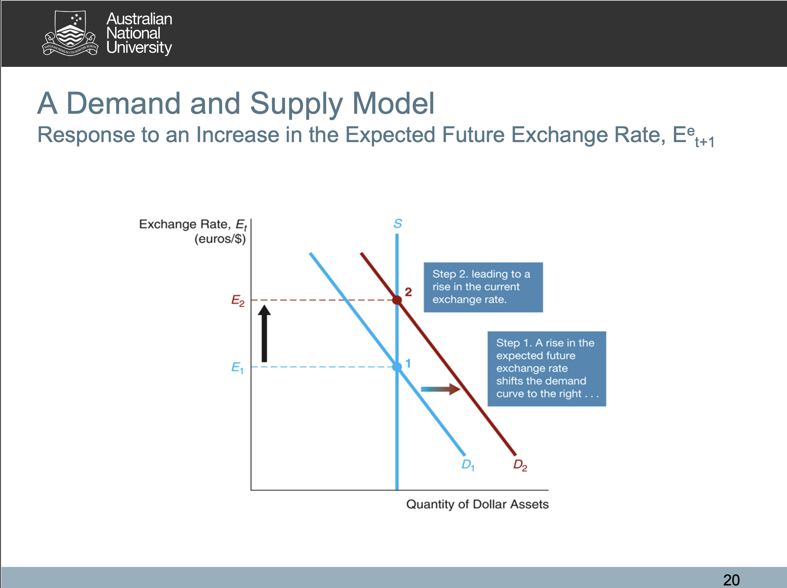

# The Foreign Exchange Market

## Exchange Rates and Trade
- **A nominal rate** is the price of one currency in terms of another currency
- Changes in the exchange rate between the dollar and foreign currencies affect the prices that Australian consumers pay for foreign imports.
- **Appreciation** is an increase in the value of a currency in exchange for another currency.
- **Depreciation** is a decrease in the value of a currency in exchange for another currency.

### Direct Quotations
**Direct quotations** are exchange rates quoted as units of domestic currency per unit of foreign currency. 1.29 AUD (domestic currency) for 1 USD (foreign currency) as of 18/04/2021.

### Indirect Quotations
**Indirect quotations** are exchange rates as units of foreign currency per unit of domestic currency. 0.77 USD (foreign currency)  for 1 AUD (domestic currency) as of 18/04/2021

<ins>*Exchange rates are volatile!!*</ins>

### Real Exchange Rate
The **real exchange rate** is the rate at which goods and services in one country can be exchanged for goods and services in another country.
$$
    \text{readl exchange rate} = \frac{\text{exchange rate} \times \text{price of good in domestic}}{\text{price of same good in foreign}}
$$

For example, we can do this with the Big Mac price

**Note that the story can be completely different when comparing big mac versus comparin CPI**

## Exchange Rates in the Long Run
- **The law of one price** is the idea that identical products should sell for the same price everywhere.
- The law of one price is the basis for **the theory of purchasing power parity (PPP)**.
- **Theory of purchasing power parity (PPP)** states that exchange rates move to equalize the purchasing power of different currencies.
- In the long run, an exchange rate should be at a level that the equivalent amount of any country’s currency can buy the same amount of goods and services.

### Example of the Theory of Purchasing Power Parity (PPP)
- Purchasing Power Parity Theorems $\implies$ The different in price determines the nominal exchange rate between two currencies.
- Arbitrage profits will exist if the nominal rate is different from the actual price-level difference
  - $\implies$ Maney exchange for the two currencies
  - $\uparrow$ Demand for one current $\implies$ the current will appreciate (and the other depreciate)
  - Then, the gap between the price level is fixed by changing the nominal rate
  - *All arbitrage profits gaps are used.*

### PPP's Prediction
If $\pi^D > \pi^F \; (\pi \text{ is inflation rate})$, the domestic currency depreciates!
$$e = \frac{E \times P^D}{P^F}$$
$$\% \Delta e = \% \Delta E + (\pi^D - \pi^F)$$
Note that $\% \Delta e$ is the percentage change in the real exchange rate.

However, note that if PPP holds, $e = 1 \implies \Delta e = 0$  
Hence $0 = \Delta E + (\pi^F - \pi^D) \implies \Delta E = \pi^F - \pi^D$  
Hence the difference in the inflation rates explain nominal exchage rate difference in the long-term.

### Limitations to the PPP
- Real-world complications keep PPP from being a complete explanation of exchange rates:
  - Not all products can be traded internationally
  - Products are differentiated
  - Governments impose barriers to trade, e.g., tariffs and quotas
    - A tariff is a tax a government imposes on imports.
    - A quota is a limit a government imposes on the quantity of a good that can be imported.

### Should Big Macs Have the Same Price Everywhere?

## A Demand and Supply Model of Short-Run
- The model determines both the equilibrium nominal exchange rate and the equilibrium real exchange rate, holding price levels constant.
- The demand for Australian dollars represents the demand by foreign households and firms for Australian goods and Australian financial assets.
- The supply of dollars in exchange for a foreign currency is determined by the willingness of households and firms that own dollars to exchange them for the foreign currency.

### Explaination
Two countries
- Domenstic -> interest rate $i^D$
- Foreign -> intereate rate $i^F$

$$
E_t \text{ : current exchange rate} \\
E^e_{t+1} \text{ : future expected exchange rate}
$$

$$\text{Expected rate of app/dep} = \frac{E^e_{t+1} - E_t}{E_t}$$

Now, if this expected rate is positive, we will expect an appreciation, while if it is negative, we expect a depreciation in the domestic currency.

Then, we can calculate returns in terms of foreign currency.
- Expected returns on domestic assets in terms of foreign currency.
  - $\displaystyle R^D = i^D + \frac{E^e_{t+1} - E_t}{E_t}$
  - Note that the second term is gain/loss made by foreigners from converting foreign currency into domestic currency
  - $R^D > R^F \implies \uparrow \text{Demand for domestic assets}$
  - Hence, in the equilibriun $R^D = R^F$
  - This would imply that in the equilibrium
  - $\displaystyle i^D + \frac{E^e_{t+1} - E_t}{E_t} = i^F$

- Expected returns on foreign assets in terms of foreign currency.
  - Well, the second case is fairly trivial, it is simply just $R^F = i^F$
  
Hence, we get the following with simple arithematic:
$$E_t = \frac{E^e_{t+1}}{i^F - i^D + 1}$$
Note that the above equation is called the interest rates parity condition. And, we get the following statements:
- $\uparrow E^e_{t+1} \implies \uparrow E_t$
- $\uparrow i^F \implies \downarrow E_t$
- $\uparrow i^D \implies \uparrow E_t$

## Summary
We have two theorem to explain the exchange rate:
- Long-term
  - PPP: $\% \Delta E = \pi^F - \pi^D$
- Short-term
  - Interest Parity Conditions

### Some examples

## Demand and Supply Model

### Exchange rate Intervention
- Unsterlised Intervetions
  - B (monetary base) is allowed to fluctuate
- Sterlilised interventions
  - B will not change

#### Unsterilised Interventions
  - Ex: CB buys foreign asets (sell domestic currency) with a check of $1 Billion
  - $B = R + C$
  - Buying foreign assets => increase R => increase B => increase M since $M = m \cdot B$
  - increase in M => increase expected inflation rate => decrease in expected real return on domestic assets ($i^D - \pi^e$)
  - Then, this will cause the exchange rate to decrease and depreciate the domestic currency

#### Sterilised Foreign Exchange Rate Intervention
  - Ex: Selling $1 billion of foreign assets (this is equivalently saying they buy domestic currency)
  - This will results in decrease in monetary base($B$) (contractionary monetary policy (緊縮政策))
  - CB wants to keep $B$ constant => Therefore, CB will [buy domestic treasury bond] conduct Open Market Purchase of $1 billion of domestic treasury bond
  - This would increase in $B$, so we will have $\Delta B = 0$
  - Since, monetary base does not change => monetary supply does not change ($\Delta M = 0$) => Expected inflation rate does not change => expected real returns on domestic assets ($i^D - \pi^e$) will not change => Demand will not change => Exchage rate wil not change.

# Exchange Rate Regimes and the International Financial System 

## Exchange Rate Regimes
- **Exchange-rate regime** is a system for adjusting exchange rates and flos of goods and capital among countries
- Fixed exchange rate regime
  - Value of a currency is pegged relative to the value of one other currency (anchor currency)
  - Note that this will take away the freedom to use monetary policy
- Floating exchange rate regime
  - Value of a curency is allowed to fluctuate against all other currencies
- Managed float regime (dirty float) => This is the middle one between the the two above.
  - Attempt to influence exchange rates by buying and selling currencies
  - This is what the Chinese government use.

### Fixed Exchange Rate Regime
- When the domestic currency is overvalued (the target exchange rate is higher than actual), the central bank must
  - purchase domestic currency to keep the exchange rate fixed (it loses international reserves), 
  - or conduct a devaluation => Change the $E_{par}$ to $E_1$

Note that for the first option, we will have a contractionary monetary policy (buying domestic currency). This implies decrease in reserve and hence the monetary base. Therefore, the money supply $M$ will decrease as well. This would imply that the expected inflation rate decrease. Hence, higher expected real return on domestic assets. Therefore, the demand increases and increases the nominal exchange rate.

- When the domestic currency is undervalued (the target exchange rate is lower than actual), the central bank must
  - buy foreign assets/sell domestic currency to keep the exchange rate fixed (it gains international reserves), 
  - or conduct a revaluation

Buy foreign assets => Increase in reserve and monetary base. => Increase in money supply => Increase in expected inflation rate => Decrease expected real return on domestic assets ($i^D - \bar{\pi}^e$) => Decrease the demand => Decrease the exchange rate.

Questions:
Why less monetary supply implies inflation rates to decrease?  
Why expected real return rate is equal to $i^D - \pi^e$