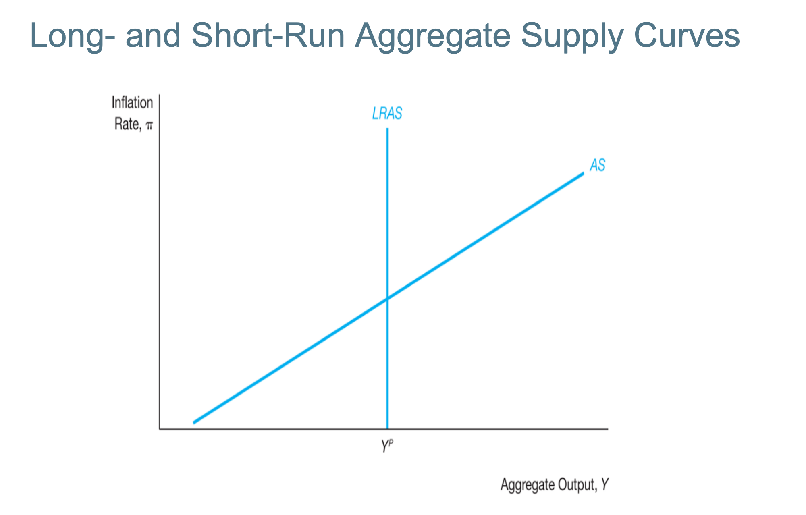

# Aggregate Demand (Recap from Last Week)

- AD: Y (GDP) and $\pi$
- AS: Y (GDP) and $\pi$
  - where $\pi$ is inflation rate
  
$$
Y^{ad} = C + I + G + \text{NX}
$$

$$
\pi \uparrow \rightarrow r \uparrow \rightarrow I \downarrow \rightarrow Y^{ad} \downarrow
$$

## NP Curve
Shows the relationship between the inflation rate and the real interest rate

## IS Curve
Shows the relationship between real interest rate and GDP

## AD Curve
Combines the two above, and it shows a negative relationship between inflation rate $\pi$ and GDP $y$.

## The Main Mechanism for Having Negative Relationship in the AD Curve
- First Link (From Investment Demand): When there is an increase in inflation rate, then the real interest rate increases because the monetary policy curve and CBs follow Tayler's rule. This implies lower investment demand ($I_d$). This causes lower aggregate demand as shown in the AD equation above.
- Second Link (From Import/Export Aspect): When there is an increase inflation rate, this implies an increase in real interest rate. However, this would implies appreciate in domestic assets and hence domestic currency. Therefore, there is an increase in exchange rate and hence decrease export demand and also net export. This would reduce the aggregate demand as well.

### Aggregate Demand Equation
$$ Y = \frac{\bar{A}}{1 - c} - \frac{d + x}{1 - c}(\bar{r} + \lambda\pi) $$
where, 
$$ \bar{A} = \bar{C} - c\bar{T} + \bar{I} - d\bar{f} + \bar{G} + \bar{NX}$$

Therefore changes in $\bar{A}$ will shift the demand curve. The first term is affected by the IS curve. The first one is affected by Fiscals policy. <ins>(Fiscal policy refers to the government’s use of spending and taxation to influence the economy.)</ins>
 The second term is affected by the change in Monetary Policy.

Factors that shift AD to the right: 
- $\downarrow \bar{r}$ (monetary policy easing), changes in components of autonomous term correspondingly.

# Aggregate Supply (AS)
- Prices and wages are sticky.
  - They are changing in a lower pace. (Keynesian Assumption)

## Long-run Aggregate Supply (LRAS)
- Long-run Aggregate Supply (LRAS) reflects the economy strength (?)
$$
  Y = F(K, L, A)
$$
,where  
$F$ is the production function. (We don't need to know the technical detail of this function. The course will simply provide it.)  
$K$ is capital stock  
$L$ is labour supply
$A$ is total factor of productivity (TFP) --- technology.

At the long run: Labour (L) is at full employment
  - Full employment $\implies$ $\text{unemployment rate} = \text{natural rate of unemployment}$ 
    - Note that the natural rate is approximately 4% -- 5% for many economies.
    - Note that natural rate of unemployment is unavoidable.
    - It has two components:
      - Frictional Unemployment
        - People in going for searching
      - Structural Unemployment
        - Due to structural changes $\implies$ For example, AI consumes some jobs but create some new job opportunities
  - The unemployment that is not wanted in economic perspective:
    - Cyclical unemployment:
      - Happens due to business cycles
        - For example, a skii coach is typically unemployed over the summer.
        - Can avoid with Fiscal Policies and Monetary Policies.
      - In the long-run, $\text{cyclical unemployment} = 0$
      - $\star$ **In the short-run, it might be larger than zero. MP (and/or Fiscal Policy) will help to get rid of it!**

Note that the Potential DP where unemployment rate = natural unemployment rate (full employment) is where the $LRAS$ curve is.

## Short-run Aggregate Supply (SRAS)
Based on the idea that 3 factors that generate $\pi$ <ins>in any economy</ins>
  - Future Inflation Expectation (**THE MOST IMPORTANT ONE**) $\pi^e$
  - Persistent Output Gap
    - Constantly generating more things than needed
    - Explained later
  - Price (Supply) Shock
    - Explained later

### Inflation Expectation $\pi^e$
- $w_n$ nominal wages
- $w_r$ real wages (in terms of goods and accessories)
  - We feel focus on the real wages
  - Matters for worker and firms!

$\uparrow P$ (Price Level) $\implies$ Workers Expect Adjustment to Nominal Wages ($\uparrow w_n$) $\implies$ Increase in Inflation Expectation (one for one increase) $\uparrow \pi^e$

Now, since $w_n = w_r + \pi^e$, then assuming the real wage is a constant. Remember meet important production cost: WAGES!

$$\uparrow \pi^e \implies \uparrow \pi $$
This is another channel that is going to chage as well.

### Output Gap
The difference between the level of GDP (we observed) and the potential GDP
$$
  \text{Output Gap} = Y - Y^P
$$
,where
- $Y^P$ is the predicted GDP
- $Y$ is the current GDP

Three Situations
- Positive Ouput Gap $\impliedby Y > Y^P$
  - Problematic because we will have very tight labour market (More jobs, less works) Market is tight in firm's perspective.
  - Workers will demand higher wages since the market is tight. Hence, the prices will increase since wages is the primary source of cost.
  - Firms: $\uparrow P \implies \uparrow \pi$
- Negative Ouput Gap $\impliedby Y < Y^P$
  - Slack Labour Market (More workers, less jobs) $\implies$ Demand lower wages $\implies$ Decrease the cost of productions and price levels.

### Price (Supply) Shock
Facing shocks outside of the economic system. Boeing shock may affect any upstream or downstream producers. 

#### Example 1
Restriction of supply of oil $\implies$ increase the price of oils $\implies$ increase price of other goods and services (not oil producing countries) $\implies$ $\uparrow \pi$ Increases in Inflation. Hence
$$
  \uparrow P_{\text{Imported Goods tah used as Input}} \implies \uparrow P_{\text{Goods \& Services}} \implies \uparrow \pi
$$

#### Example 2
Strong Labour Unions $\implies$ Implies increase in wages by too much $\implies$ Significant increase in price levels $\implies$ Increase in inflation.

### SRAS Equation
$$
  \pi = \pi^e + \gamma(Y - Y^P) + \mathcal{p}
$$

- $\pi^e$ expected inflation
- $\gamma$ The sensitive ness of output gap
- $Y - Y^P$ The output gap
- $p$ the price shocks

## Going Back to the Graph

- Shifts in LRAS $\impliedby$ An increase in the parameters will increase in the LRAS (right shifting it).
- Shifts in SRAS $\impliedby$
  - Inflation Expectation $\pi^e$
  - Persistent output gap
  - Price (supply) shock
  - Increase in any of these factors will shift the curve up.
  - Explanation
    - increase in inflation expectation $\implies$ increase in nominal wages $\implies$ increase in price level $\implies$ increase in inflation rate $\implies$ SRAS shifts up (left)
    - $p$: increase in price level $\implies$ increase in inflation rate $\implies$ SRAS shifts up

#### Explaination of the affect of persistent output gap
- Cannot stay in the left of $Y^P$ as we are producing much less than I can $\implies$ Idle workers and factories
  - Then, move along the SRAS curve to $Y^P$
- Cannot stay in the right of $Y^P$ as well as we are strectching the resources $\implies$ Overworking...
  - Also, move along the curve to $Y^P$

Therefore, increase or decrease in the output gap $\implies$ increase or decrase inflation rate. This mainly ties with having tight or slack labour market. Hence, this will adjust the inflation expectation and SARS will shift according to how inflation expectation would change.
- Note that if no regulation comes into this part, it will form a positive loop for increasing the inflation rate. (This loop will continue on until the output gap is fixed.)

## Equilibrium
Long-term equilibrium is achieved when the AD, SRAS, and LRAS intersects together.

Note that if the predicted output and current output does not match, short-term equilibrium must moves.

### Policy ...
If short-run equilibrium is larger then potential production, then we have a positive ouput gap. Note that this would lead to a tight labour market, and hence an increase in price level as the demanded wages and the cost of production would increase. Therefore, the inflation would increase and the **inflation expectation** would also increase. Then, the increase in inflation expectation implies the SRAS will shift up.

Now, note that the short-term equilibrium (intersection between SRAS and AD) will shifts left, towards the predicted output even though it might not be exactly on the long-run equilibrium point. Therefore, eventually, the inflation point will eventually equal to the long-run equalibrium (intersection between LRAS and AD).

This process is called a self-correction mechanism and will forced the changes. Therefore, it is impossible to stay away from the long-run equilibrium for a long time. However, we don't know how long it will take to achieve the equilibrium. Therefore, CB will prefer intervention in order to speed up the process.

## AD Shocks
Positive AD Shock => AD shift right
This would then by putting the the AD curve goes up and shifts the short-term equilibirum right and the auto-correction mechanism will be shifting the long-term equilibrium interest rate up. However, this does not happen right away. However, this still requires a latency for the self-correction mechanism to perform the action.

## The Volcker Deinflation
Similar to above, we can shift the AD to the left (negative AD shock). This would cause the short-term equilibrium be on the left of the long-run equilibrium. This would then eventually be shifting the inflation rate down by the self-correcting mechanism.

Want to decrease inflation. => OPS (contractionary) => higher interest rate => increase in real interest rate => decrease in inflation rate.

Now, the AD curve moves down, then the GDP is far left to the $Y^P$. Then, there was a slack labour market => decrease in nominal wage => decrease in price level => decrease in inflation rate => decrease inflation expectation => shifting the SRAS down.

Note that this does not quantify how much it should go, but simply a graph drawing exercise.

## Philips Curve
The relationship between inflation rate and unemployment rate ($u$). Note that the equation is highly similar to aggregate supply but just linking to different things.
$$
  \pi = \pi^e - w(u-u_n) + \rho
$$

- $w$ is the weights of the unemployment gap
- $\rho$ is the price shocks

Hence, increase in inflation expectaion increases the inflation rate.

Note that Okun's Law: 
$$
  u - u_n = \frac{1}{2}(y - y_P)
$$

Hence, the SRAS can be expressed similarly with the gap in unemployment rate.

